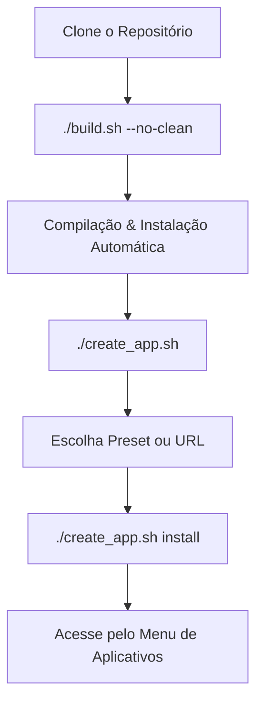

# 🚀 INÍCIO RÁPIDO - CLAW Launcher

Gerenciador e executor de WebApps isolados e otimizados para Linux (Fedora Kinoite, Silverblue, COSMIC, Workstation e distribuições baseadas em Debian/Ubuntu).

---

## ⚠️ 3 Passos para Começar

### 1️⃣ Instalar Dependências e Compilar
Execute o script centralizado para configurar dependências do sistema (incluindo WebKit2GTK 4.1, Libadwaita e Rust) e compilar o launcher automaticamente:

```bash
# Entre na pasta do projeto e dê permissão de execução
cd ./Claw_Launcher_Linux_App_Rust-main
chmod +x *.sh

# Execute o instalador completo (configura dependências, compila e instala)
./install.sh
```
# Desistalar tudo
```bash


```

> [!NOTE]
> Se você estiver no **Fedora Kinoite ou Silverblue (Atomic)**:
> O script configurará as dependências necessárias no sistema de arquivos imutável do host e instalará o Rust via `rustup`. Se for necessário criar uma nova camada com o `rpm-ostree`, reinicie o sistema antes de continuar.
>
> Após reiniciar, você pode executar o build pulando a checagem de dependências:
> ```bash
> ./build.sh --skip-deps
> ```

---

### 2️⃣ Criar uma Instância de WebApp
Você pode criar instâncias personalizadas (fornecendo uma URL de sua preferência) ou usar modelos pré-configurados (como WhatsApp, Notion, YouTube, etc.):

```bash
# Menu interativo para gerenciamento e criação
./create_app.sh
```

Ou diretamente via linha de comando:

```bash
# Criar a partir de modelos pré-configurados
./create_app.sh preconfigured

# Criar com uma URL e nome personalizados
./create_app.sh custom
```

---

### 3️⃣ Instalar no Menu do Sistema
Após criar suas instâncias, registre o aplicativo para que ele apareça no menu do seu ambiente gráfico:

```bash
# Instala todas as instâncias criadas no menu de aplicativos do sistema
./create_app.sh install
```

Pronto! Seu WebApp estará disponível no menu do seu sistema de maneira totalmente integrada.

---

## 🔧 Comandos Úteis

### Gerenciamento de WebApps
| Comando | Descrição |
| :--- | :--- |
| `./create_app.sh custom` | Abre o assistente para criar um WebApp personalizado. |
| `./create_app.sh preconfigured` | Cria WebApps a partir de presets populares. |
| `./create_app.sh list` | Lista todas as instâncias ativas no sistema. |
| `./create_app.sh install` | Instala/registra as instâncias criadas no menu do sistema. |
| `./create_app.sh uninstall` | Remove as instâncias do menu de aplicações do sistema. |
| `./create_app.sh clean` | Limpa caches de compilações antigas. |

### Build e Instalação do Launcher
| Comando | Descrição |
| :--- | :--- |
| `./build.sh` | Compila o Claw Launcher e o instala em `~/.local/bin/` (re-registra ícone e `.desktop`). |
| `./build.sh --clean` | Limpa o cache do Cargo antes de iniciar a compilação. |
| `./build.sh --no-clean` | Ignora a limpeza do cache para acelerar a compilação. |
| `./install.sh --uninstall` | Desinstala completamente o Claw Launcher do sistema. |

---

## 🚀 Fluxo de Trabalho Recomendado



---

## 🛠️ Resolução de Problemas Comuns

### Cookies ou Sessões Não Persistem
As sessões e cookies são mantidos de forma isolada para cada aplicação. Se precisar limpar o cache e deslogar de um app:
1. Execute `./create_app.sh`
2. Selecione a opção **Limpar cache** (Opção 6)
3. Selecione a instância que deseja reiniciar.

### Links Abrindo Fora da Janela
O navegador interno está configurado para gerenciar navegações internas de maneira integrada. Links para domínios externos abrirão no seu navegador padrão do sistema para manter a segurança e isolamento.

---

## 📦 Otimizações de Build (sccache + LLD)
Para acelerar em até 4x compilações futuras, os scripts de dependências configuram automaticamente o linker rápido `lld` e o cache do compilador `sccache`.
Se você deseja confirmar que o cache está funcionando:
```bash
sccache --show-stats
```
