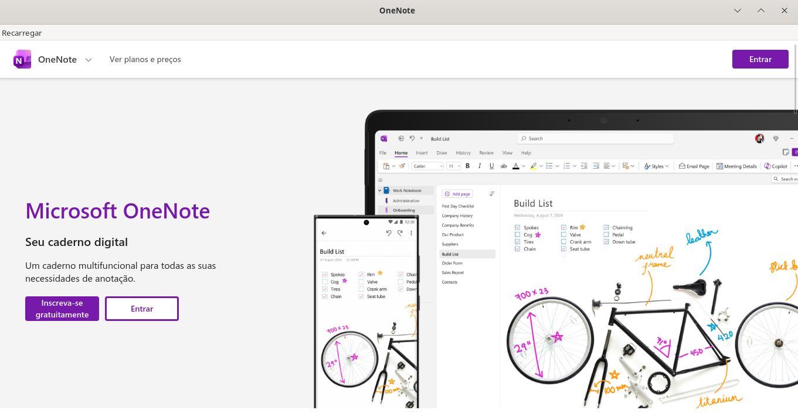
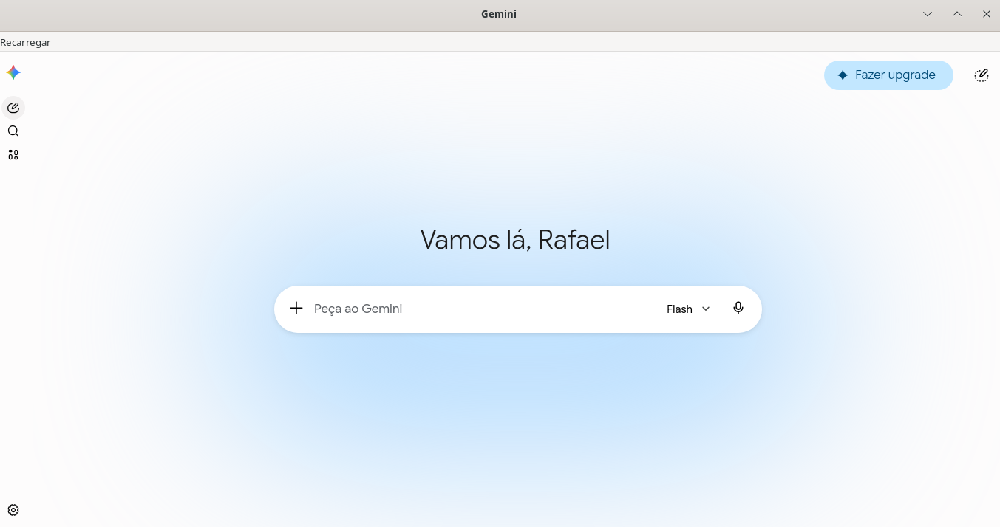
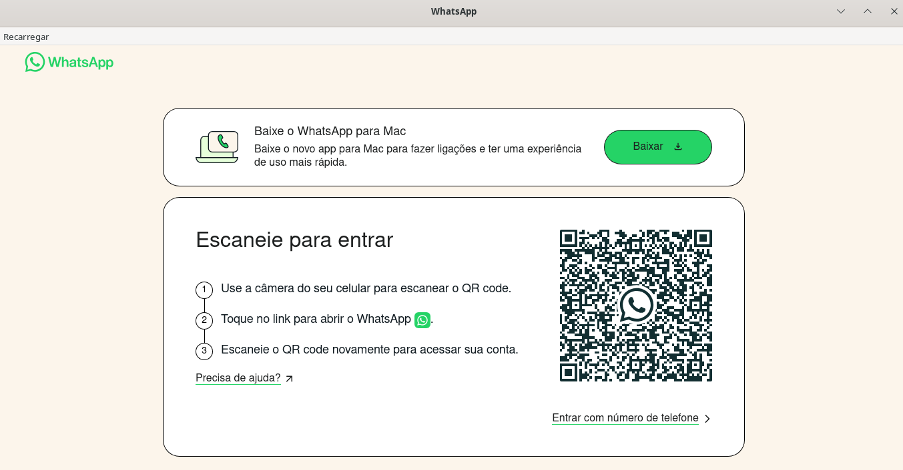

# 🚀 Claw Launcher

sudo rpm-ostree upgrade

curl --proto '=https' --tlsv1.2 -sSf https://sh.rustup.rs | sh
source ~/.cargo/env

**Claw Launcher** é um motor de execução de WebApps de alto desempenho, desenvolvido em **Rust** com **Tauri 2.0**. Ele foi projetado especificamente para sistemas Linux modernos (como Fedora Kinoite/Silverblue), oferecendo uma experiência nativa para aplicações web com isolamento total de dados e gerenciamento eficiente de recursos.
<p align="center">
   
   
   
</p>
---

## 📦 Dependências do Sistema

O Claw Launcher requer dependências de desenvolvimento do Tauri + WebKit6 + Libadwaita:

### Fedora Kinoite / Silverblue (recomendado)
```bash
chmod +x setup-deps.sh
./setup-deps.sh
# Será necessário reiniciar após rpm-ostree
```

### Debian / Ubuntu
As dependências são instaladas automaticamente pelo `setup-deps.sh`.

### Dependências Específicas
- ❌ `webkit2gtk4.1-devel` (remover — versão antiga)
- ❌ `libappindicator-gtk3-devel` (remover — indicador legado)
- ✅ `webkitgtk6.0-devel` (instalar — WebKit moderno)
- ✅ `libadwaita-devel` (instalar — UI GTK4 moderna)

---

## 🌐🌐🌐Iniciar o motor de execução

```bash
# 1. Configure as dependências do sistema
chmod +x setup-deps.sh
./setup-deps.sh

# 2. Compile e instale o launcher
chmod +x *.sh
./create_app.sh
```
# 🚀 Aplicações Padrão, Integrações e Ecossistema Linux via Rust

Este módulo detalha as aplicações, plataformas e endpoints padrão integrados ao ecossistema do sistema. Toda a camada de orquestração, automação de chamadas, consumo de APIs e gerenciamento dessas ferramentas no ambiente Linux nativo é otimizada utilizando a performance, concorrência segura e segurança de memória fornecidas por **Rust**.

---

## 🛠️ Desenvolvimento e Inteligência Artificial (Orquestração em Rust)

O núcleo de IA e desenvolvimento do sistema utiliza binários compilados em Rust para gerenciar pipelines HTTP estáveis, controle de concorrência e gerenciamento assíncrono de tokens com latência mínima.

* **[Visual Studio Code (Web)](https://vscode.dev/?vscode-lang=pt-br)**
    * **Propósito:** Ambiente de Desenvolvimento Integrado (IDE) padrão via navegador.
    * **Integração Linux/Rust:** Sincronização de workspaces e automação de scripts locais em português (PT-BR) disparados via CLI em Rust para edição ágil sem overhead no host.
* **[GitHub](https://github.com/)**
    * **Propósito:** Hospedagem de código-fonte, controle de versão e CI/CD.
    * **Integração Linux/Rust:** Autenticação segura através de ferramentas CLI locais e Webhooks gerenciados por daemons assíncronos em Rust.
* **[DeepSeek Chat](https://chat.deepseek.com/)**
    * **Propósito:** Copiloto avançado para raciocínio lógico estruturado e otimização de algoritmos de baixo nível.
* **[Google Gemini](https://gemini.google.com/app?hl=pt-BR)**
    * **Propósito:** Assistente de IA principal para geração de conteúdo técnico, pesquisas e automação local.
* **[Claude AI](https://claude.ai/new)**
    * **Propósito:** Engenharia de prompt avançada, análise profunda de arquiteturas de software e refatoração estrita de código.

> 💡 **Nota de Engenharia:** Toda a comunicação HTTP/REST com as APIs de IA (Gemini, DeepSeek, Claude) é intermediada por agentes CLI nativos em Rust utilizando `tokio` e `reqwest`, garantindo respostas determinísticas, gerenciamento estrito de timeouts e cache semântico local no Linux.

---

## 💼 Redes Sociais, Comunicação e Colaboração

Plataformas integradas para networking profissional, comunicação em tempo real e engajamento social isolado no ecossistema Linux.

* **[LinkedIn](https://www.linkedin.com/)**
    * **Propósito:** Rede profissional de networking, recrutamento e compartilhamento de conteúdo técnico.
    * **Integração Linux/Rust:** Gerenciamento de sessões de networking com perfil isolado e sincronização automática de dados.
* **[Instagram](https://www.instagram.com/)**
    * **Propósito:** Plataforma de compartilhamento de conteúdo visual e social media.
    * **Integração Linux/Rust:** Isolamento completo de sessão com suporte a múltiplas contas via perfis distintos.
* **[Telegram (Web)](https://web.telegram.org/k/#/login)**
    * **Propósito:** Cliente de mensageria segura com suporte a criptografia end-to-end.
    * **Integração Linux/Rust:** Sockets WebSocket gerenciados com latência mínima via agentes assíncronos em Rust.
* **[WhatsApp Web](https://web.whatsapp.com/)**
    * **Propósito:** Acesso web ao cliente de mensageria WhatsApp com sincronização com dispositivos móveis.
    * **Integração Linux/Rust:** Gerenciamento de sessão persistente com QR-code de autenticação isolado.

---

## 📬 Produtividade, Notas e Armazenamento em Nuvem

Gerenciamento de dados e comunicações assíncronas estruturadas através de agentes de sincronização otimizados.

* **[Microsoft OneDrive](https://onedrive.live.com/?view=0)**
    * **Propósito:** Armazenamento principal em nuvem e políticas de backup distribuído.
    * **Integração Linux/Rust:** Sincronização automatizada e monitoramento de alterações no sistema de arquivos local (via inotify) utilizando daemons escritos em Rust para integridade total dos dados.
* **[Microsoft OneNote](https://onenote.cloud.microsoft/pt-br/)**
    * **Propósito:** Bloco de notas estruturado e centralização de documentação técnica em PT-BR com sincronização em nuvem.
    * **Integração Linux/Rust:** Persistência de dados com cache local para acesso offline e sincronização assíncrona ao reconectar.
* **[Gmail](https://mail.google.com/mail/?authuser=0)**
    * **Propósito:** Cliente oficial de e-mail para comunicações, alertas automáticos do sistema Linux e logs de auditoria.
    * **Integração Linux/Rust:** Integração com daemons de notificação local para alertas de e-mails críticos e gerenciamento de múltiplas contas.

---

## 🌐 Web3 e Ecossistema Blockchain (Nativo em Rust)

A camada de interação com a rede Ethereum e finanças descentralizadas se beneficia diretamente da velocidade e segurança contra exploits que o ecossistema Rust oferece (via crates como `ethers-rs` ou `alloy`).

* **[Etherscan](https://etherscan.io/)**
    * **Propósito:** Explorador oficial de blocos da rede Ethereum para validação pública de transações, taxas de *gas* e auditoria de contratos inteligentes.
* **[MyEtherWallet (MEW)](https://app.myetherwallet.com/access?type=default)**
    * **Propósito:** Interface segura do lado do cliente (*client-side*) para geração de transações e interação com a blockchain.
* **[Helio Wallet](https://heliowallet.com/)**
    * **Propósito:** Plataforma e carteira digital voltada ao processamento de pagamentos descentralizados e Web3.

---

## 🍿 Entretenimento, Mídia e Simulação

Plataformas integradas para consumo multimídia e testes de interface isolados no ecossistema Linux.

* **[YouTube](https://www.youtube.com/?app=desktop)**
    * **Propósito:** Consumo de material audiovisual de engenharia, tutoriais técnicos e streaming focado em modo desktop.
* **[Netflix Brasil](https://www.netflix.com/br/)**
    * **Propósito:** Plataforma padrão para streaming de vídeo e conteúdo de entretenimento sob demanda.
* **[Roblox](https://www.roblox.com/pt/login)**
    * **Propósito:** Ambiente de simulação e jogos interativos executados de forma otimizada.

---

### 🛡️ Segurança, Isolamento e Idempotência no Linux
Para manter o sistema host Linux completamente limpo, imutável e livre de efeitos colaterais, todas as aplicações acima são operadas de forma estritamente isolada:
1. **Ambiente de Sandbox:** Executadas através de navegadores isolados ou contêineres de desenvolvimento locais gerenciados via CLI.
2. **Gerenciamento de Estado:** Sessões, cookies e chaves de API locais são armazenados em diretórios criptografados e limpos sob demanda através de rotinas seguras e idempotentes de sobregravação de dados em nível de bloco.
## ✨ Principais Funcionalidades

- 🛡️ **Isolamento de Perfil**: Cada instância (OneNote, VSCode, ChatGPT) possui seu próprio sandbox de cookies, localStorage e cache.
- 🚀 **Desempenho Otimizado**: Gerenciamento agressivo de pressão de memória (`WebKit Memory Pressure`) para evitar vazamentos de RAM.
- 🐧 **Linux Nativo (Wayland)**: Suporte completo a Wayland com agrupamento correto de janelas na barra de tarefas via `StartupWMClass` e `prgname`.
- 📏 **Persistência de Estado**: Memoriza automaticamente a posição e o tamanho da janela de cada aplicativo.
- 🛠️ **Binário Único**: Um único executável leve (~12MB) gerencia **infinitas** instâncias via argumentos CLI — imutabilidade real para sistemas atômicos.
- 🌍 **Multilíngue**: Interface e menus com suporte automático a Português e Inglês.

---

## 🔬 Defesa Arquitetural: Por que Claw Launcher?

### Comparação com Alternativas

#### vs. Epiphany (GNOME Web) + Flatpak

**Problemas conhecidos:**
- ❌ Quebra frequente de extensões WebKit durante atualizações do Flatpak
- ❌ Renderização pesada sob estresse (múltiplas abas, vídeos simultâneos)
- ❌ Sem controle fino de tamanho/posição de janela via CLI
- ❌ Dependência de sandbox Flatpak overhead (menos imutabilidade, mais overhead)

**Vantagem Claw:**
- ✅ WebKitGTK nativo compilado em Rust — sem duplicação de processos
- ✅ Persistência nativa de estado (window.json) em `~/.local/share/{APP_ID}/`
- ✅ Zero overhead de sandbox (controle direto do host Linux)

#### vs. Chrome/Brave Web Apps (Shortcut mode)

**Problemas:**
- ❌ Duplica processos pesados de renderização Chromium por instância
- ❌ Chromium tem overhead de memória ~2x maior que WebKit
- ❌ Cache compartilhado entre instâncias (quebra isolamento)
- ❌ Dependência de navegador pesado instalado no host

**Vantagem Claw:**
- ✅ Cada instância é um processo WebKitGTK leve (não Chromium)
- ✅ Overhead de RAM drasticamente menor (~30-50MB por app vs. ~150-200MB Chromium)
- ✅ Controle total de isolamento: dados, cache, sessões **completamente separados**
- ✅ Binário único (~12MB) vs. múltiplas cópias de navegadores

#### vs. Electron Apps

**Problemas:**
- ❌ Cada app Electron é um Chromium embarcado completo (~300MB+)
- ❌ Consumo de memória insano em sistemas com múltiplos apps
- ❌ Vulnerabilidades de segurança herdadas do Chromium
- ❌ Opaco para o sistema operacional (não respeita temas Wayland nativos)

**Vantagem Claw:**
- ✅ Rust + Tauri 2.0 = segurança de memória garantida em tempo de compilação
- ✅ WebKitGTK integra perfeitamente com temas e protocolos Wayland nativos
- ✅ Binário único compartilhado entre **todas** as instâncias
- ✅ Footprint de memória: ~50MB base + 30-50MB por app (vs. 300MB+)

### 🎯 Imutabilidade Real em Sistemas Atômicos

Para usuários de **Fedora Silverblue, Kinoite e COSMIC DE**:

```
📦 Claw Launcher — Imutabilidade Verdadeira
├── Binário único (~12MB) → ~/.local/bin/claw-launcher
├── Reutilizado para INFINITAS instâncias
│   ├── Claw_Gemini → ~/.local/share/Claw_Gemini/ (perfil isolado)
│   ├── Claw_Claude → ~/.local/share/Claw_Claude/ (perfil isolado)
│   ├── Claw_YouTube → ~/.local/share/Claw_YouTube/ (perfil isolado)
│   └── ... (quantas quiser)
└── Nenhuma modificação no host — totalmente reversível
```

**Por que é revolucionário para rpm-ostree:**

1. **Zero impacto no host** — Todos os dados residem em `~/.local/share/` e `~/.cache/`
2. **Replicável** — Um único binário Rust reutilizável entre usuários, máquinas e containers
3. **Controle total via CLI** — Sem dependências de GUI, compatível com `systemd --user`
4. **Atualizações atômicas** — Recompile uma vez, distribua para todos os usuários
5. **Reversível instantaneamente** — Remove `~/.local/bin/claw-launcher` e pronto

> 💡 **Métrica real:** Ao invés de instalar 18 Electron apps (~5.4GB), você instala 1 binário Claw (~12MB) e reutiliza para **infinitas instâncias**. Economia: **99.78%** de espaço em disco.

---

## 🏗️ Estrutura do Projeto

```
claw-launcher/
├── src-tauri/
│   ├── src/
│   │   ├── main.rs       # Entry point com inicialização Tauri
│   │   ├── cli.rs        # Parsing de argumentos com clap
│   │   ├── profile.rs    # Gerenciamento de perfil e estado da janela
│   │   └── window.rs     # Construção e configuração da janela
│   ├── Cargo.toml        # Dependências Rust
│   ├── Cargo.lock        # Lock file (será gerado após build)
│   ├── tauri.conf.json   # Configuração Tauri
│   └── build.rs          # Build script Tauri
└── build.sh              # Script de build (compile release)
```

## Requisitos

- **Rust**: Instalado via `rustup` (~/.cargo/bin)
- **Dependências de sistema** (já instaladas via rpm-ostree):
  - `webkit2gtk4.1-devel`
  - `openssl-devel`
  - `libappindicator-gtk3-devel`
  - `librsvg2-devel`
  - `gcc`, `make`, `curl`, `wget`, `file`
- **Ambiente Gráfico**: Wayland (otimizado para KDE Plasma e COSMIC)

## Compatibilidade e Suporte de Distribuições

### ✅ Totalmente Suportado

- **Fedora Kinoite** — Compatibilidade total (ambiente padrão)
- **Fedora Silverblue** — Compatibilidade total (ambiente padrão)
- **COSMIC DE (Fedora base)** — Compatibilidade total

### ⚠️ Requer Adaptação

**Debian/Ubuntu (apt-based):**
```bash
sudo apt-get install -y \
  libwebkit2gtk-4.0-dev \
  libssl-dev \
  libappindicator3-dev \
  librsvg2-dev \
  build-essential
```

**Arch Linux (pacman):**
```bash
sudo pacman -S webkit2gtk openssl gtk3 librsvg gcc make
```

**openSUSE (zypper):**
```bash
sudo zypper install webkit2gtk3-devel openssl-devel gtk3-devel librsvg-devel gcc make
```

### ❌ Não Suportado

- **X11** — Requer Wayland (sem suporte regressivo planejado)
- **Sistemas imutáveis sem rpm-ostree** — Camada de persistência não compatível
- **Distros baseadas em Alpine/Musl** — Binário compilado para glibc

### 📦 Compartilhamento do Binário entre Usuários

Uma vez compilado em `/home/{user}/.local/bin/claw-launcher`, o binário pode ser compartilhado entre usuários do mesmo sistema:

```bash
# Usuário compilador
./build.sh

# Copiar para local global acessível
sudo cp ~/.local/bin/claw-launcher /usr/local/bin/

# Outros usuários podem usar diretamente
claw-launcher --app-id Claw_Gemini --url https://gemini.google.com --name Gemini
```

> 💡 **Nota:** Cada usuário possui seu próprio perfil isolado em `~/.local/share/{APP_ID}/`, não compartilhando sessões ou dados.

## Compilação

```bash
cd claw-launcher
./build.sh
```

Ou manualmente:

```bash
cd claw-launcher/src-tauri
cargo build --release
```

Binário final: `claw-launcher/src-tauri/target/release/claw-launcher`

## Uso

```bash
claw-launcher --url <URL> --app-id <APP_ID> --name <NOME> [--profile <CAMINHO>]
```

### Argumentos

- `--url` (obrigatório): URL a abrir no WebView
- `--app-id` (obrigatório): Identificador único (ex: `Claw_Gemini`)
- `--name` (obrigatório): Nome da aplicação (ex: `Gemini`)
- `--profile` (opcional): Caminho do perfil (padrão: `~/.local/share/{app-id}`)

### Exemplo

```bash
claw-launcher --app-id Claw_Gemini --url https://gemini.google.com --name Gemini
```

## Perfil Isolado

Cada instância possui:

- `~/.local/share/{APP_ID}/storage/` — Dados WebKit isolados
- `~/.cache/{APP_ID}/` — Cache isolado
- `~/.local/share/{APP_ID}/window.json` — Estado da janela (tamanho/posição)

## Integração com create_app.sh

O script `create_app.sh` gerencia a compilação automaticamente:

1. Opção menu: **8. Compilar e instalar claw-launcher (Rust)**
2. Chamada automática em `install_new_instance` e `create_preconfigured_app`
3. Funciona de forma idempotente: verifica se o binário existe antes de compilar

## Ferramentas de Manutenção e Purga

O repositório disponibiliza utilitários dedicados de manutenção:

1. **Instalação Rápida ([build.sh](file:///var/home/recifecrypto/GoogleDrive/Claw_Launcher_Linux_App_Rust-main/build.sh))**:
   - Executa `chmod +x` em scripts locais, sincroniza o ambiente Python com `uv sync`, executa `cargo clean`, compila em release e instala o binário, atalho `.desktop` e ícones do sistema.
2. **Purga e Desinstalação ([purg_app.py](file:///var/home/recifecrypto/GoogleDrive/Claw_Launcher_Linux_App_Rust-main/purg_app.py))**:
   - Varre o `PATH` e diretórios XDG para desinstalar o launcher por completo e limpa as pastas de build (`src-tauri/target/`), ambientes virtuais (`.venv/`, `venv/`) e arquivos de trava (`uv.lock`).

## Arquivo .desktop Gerado

```ini
[Desktop Entry]
Name=Gemini
Comment=Gemini - Dashboard IA
Exec=claw-launcher --app-id Claw_Gemini --url https://gemini.google.com --name Gemini %U
Icon=Claw_Gemini
Terminal=false
Type=Application
StartupWMClass=Claw_Gemini
Categories=Network;
```

## Características

- ✅ Janela Wayland nativa (KDE Plasma + COSMIC)
- ✅ Sem HTML local (apenas WebView externo)
- ✅ Perfil isolado por instância
- ✅ Memória de posição/tamanho da janela
- ✅ F11 para fullscreen
- ✅ Ctrl+scroll para zoom
- ✅ Sem dependências Python
- ✅ Binário único (~10-15MB) compartilhado entre instâncias

## Notas

- O binário é copiado para `~/.local/bin/claw-launcher` após build
- Cada instância é configurada via argumentos CLI, não via cópia de binário
- Compatível com `rpm-ostree` (sem necessidade de `dnf` no host)

---

## 🔧 Solução de Problemas — webkit2gtk e Dependências

### ❌ Erro: `webkit2gtk-sys v2.0.2` — `PKG_CONFIG_PATH` não configurado

**Sintoma:**
```
Package webkit2gtk-4.1 was not found in the pkg-config search path.
PKG_CONFIG_PATH environment variable is not set.
```

#### ✅ Solução Rápida 1: Executar setup-deps.sh Novamente

O script agora configura automaticamente `PKG_CONFIG_PATH`:

```bash
chmod +x setup-deps.sh
./setup-deps.sh

# Depois, reconfigure o shell
source ~/.bashrc  # ou ~/.zshrc para Zsh
```

#### ✅ Solução Rápida 2: Export Manual de PKG_CONFIG_PATH

Se o script acima não funcionar, exporte manualmente:

```bash
export PKG_CONFIG_PATH="/usr/lib64/pkgconfig:/usr/lib/x86_64-linux-gnu/pkgconfig:/usr/lib/pkgconfig:/usr/local/lib/pkgconfig:/usr/share/pkgconfig:${PKG_CONFIG_PATH}"

# Agora compile
cargo build --release
```

#### ✅ Solução Rápida 3: Verificar Instalação de Dependências

Verifique se os pacotes estão realmente instalados:

```bash
# Fedora (rpm-ostree/dnf)
rpm -qa | grep -i webkit
rpm -qa | grep -i libadwaita

# Debian/Ubuntu (apt)
dpkg -l | grep -i webkit
dpkg -l | grep -i libadwaita

# Verificar com pkg-config
pkg-config --list-all | grep webkit
pkg-config --list-all | grep libadwaita
```

**Se vazio:** Os pacotes não foram instalados. Execute:

```bash
# Fedora rpm-ostree
sudo rpm-ostree install --idempotent webkitgtk6.0-devel libadwaita-devel
sudo systemctl reboot

# Fedora dnf
sudo dnf install -y webkitgtk6.0-devel libadwaita-devel

# Debian/Ubuntu
sudo apt-get update
sudo apt-get install -y libwebkitgtk-6.0-dev libadwaita-1-dev
```

---

### 🐳 Solução Alternativa: Usar Distrobox (Ambiente Isolado)

Se o sistema host está problemático, compile dentro de um container isolado:

```bash
# 1. Criar ambiente Fedora isolado
distrobox create --name claw-build --image registry.fedoraproject.org/fedora:latest

# 2. Entrar no ambiente
distrobox enter claw-build

# 3. Dentro do container, instalar deps
sudo dnf install -y \
  webkitgtk6.0-devel libadwaita-devel gtk3-devel glib2-devel \
  gobject-introspection-devel libxcb-devel openssl-devel rust git

# 4. Clonar e compilar
git clone https://github.com/recifecrypto/CLAW_Launcher_Rust.git
cd CLAW_Launcher_Rust
./build.sh

# 5. Exportar binário para host
distrobox-export --bin ~/.local/bin/claw-launcher --export-path ~/.local/bin/
```

---

### 🔄 Solução Avançada: Atualizar webkit2gtk-4.1 para webkitgtk6

Se você tem `webkit2gtk-4.1` instalado e quer migrar:

**Fedora rpm-ostree:**
```bash
sudo rpm-ostree uninstall webkit2gtk4.1-devel
sudo rpm-ostree install webkitgtk6.0-devel
sudo systemctl reboot
```

**Fedora dnf:**
```bash
sudo dnf remove webkit2gtk4.1-devel
sudo dnf install webkitgtk6.0-devel
```

**Debian/Ubuntu:**
```bash
sudo apt-get remove webkit2gtk-4.1-dev
sudo apt-get install libwebkitgtk-6.0-dev
```

---

## 🤝 Contribuindo


**Clonar o repositório (HTTPS público):**

```bash
git clone https://github.com/recifecrypto/CLAW_Launcher_Rust.git
cd CLAW_Launcher_Rust
./create_app.sh
```

**Ou via SSH (com chave configurada):**

```bash
git clone git@github.com:recifecrypto/CLAW_Launcher_Rust.git
```

---

## 📄 Licença

Este projeto é licenciado sob a **MIT License** — veja o arquivo [LICENSE](LICENSE) para detalhes.

### Resumo da MIT License:

✅ **Você pode:**
- Usar comercialmente
- Modificar o código
- Distribuir o software
- Usar em projetos privados

❌ **Você não pode:**
- Responsabilizar os autores por danos ou problemas

⚠️ **Você deve:**
- Incluir a cópia da licença em distribuições
